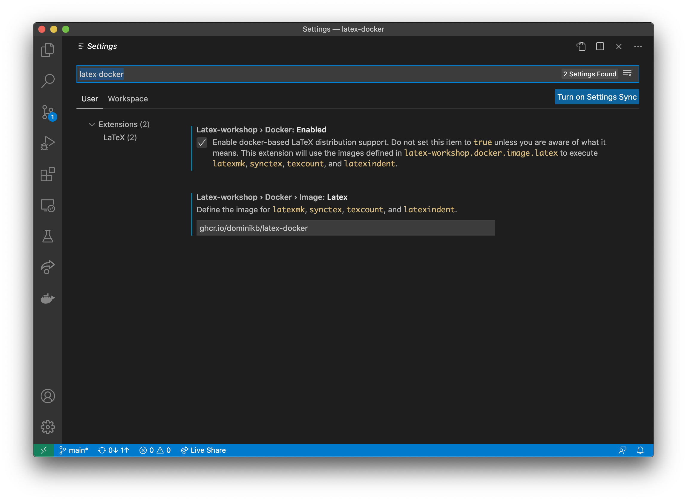

# latex-docker
Docker image to work with LaTeX.

Check out https://github.com/James-Yu/LaTeX-Workshop

## Usage

1. Pull the image

`docker pull docker.pkg.github.com/dominikb/latex-docker:latest`

2. Change the plugin configuration in VSCode settings


```
```